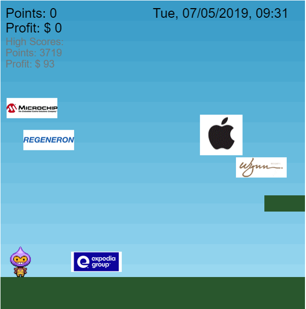

# Stock Market Gamification

[Playable version here](http://ec2co-ecsel-5zub5659xyt4-1820632623.us-east-1.elb.amazonaws.com:5000/)

Real stock market data from the last full trading day is used to move the logos
of companies on the Nasdaq 100 up and down on screen. You play a little spaceman
who has to try jump up these stocks for points and sit on rising stocks to make
profits. There can be 5 stocks on screen at once. As they move off the screen,
or you move up the screen, new stocks will be chosen and appear in a random positions.

The front end of this game was made with Phaser 3. It interacts with a Flask
server which pulls data on stock market movements from IEX's api. Highscores
are stored in a MongoDB. I put the game in a container and then put that online
using aws ECS.

This game was made as a final project for the CS50 course I was doing. As such
it was about learning new things for me it's design is not efficient. Please
bear this in mind if you plan to use this code.

For instance to update the stock movements the game needs to constantly
contact the server, which then calls IEX's api, to update the stock. However you
don't need a key for the IEX api so the whole thing could have been written in
Javascript without the need for a server at all.
